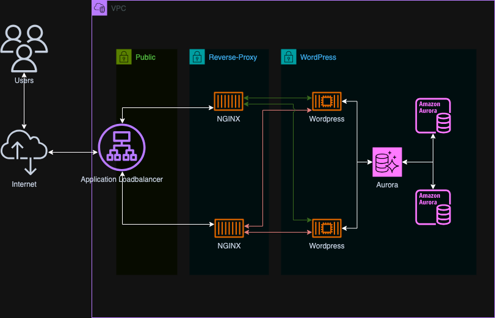

# wordpress-aws
This project was created by request for an interview process. 

## Project Requirements
> 16 hours maximum
> 
> Goal:
> 
> Build a server environment in AWS using terraform, this environment should host a demo WordPress website (this is just
> a demo to validate that the servers / database work). The web servers should be containers using AWS ECS/EKS, and the
> database can be a Maria/Mysql on RDS. The infrastructure should be built up with speed in mind, so use any AWS
> services that you think will provide the best benefits for that.
> 
> How:
> 
> Build with “small”-sized resources on a personal AWS account.

## Decision Log

* Utilize Terraform to create the infrastructure
* Utilize as much "serverless" architecture as possible to reduce amount of infrastructure to design, create, and
  maintain
* Utilize AWS ECS to run containerized services
* Utilize the PHP-FPM version of the official WordPress Docker image for speed and efficiency
* Utilize AWS Aurora Serverless for the database
* Implement a redundant architecture to ensure high availability
* Utilize caching where possible to reduce load on the WordPress containers
* Utilize NGINX as a reverse proxy to the WordPress containers
* Ensure services involved can scale up and down separately as needed
* Encapsulate AWS best practices where possible
* Utilize an ALB to distribute traffic to the reverse proxy and enable WAF and other products to be added later since an
  ALB is one of the supported services.

## Architecture
### Overview

### Application Load Balancer
The ALB is the entry point for all traffic to the WordPress site. It forwards traffic to the NGINX reverse-proxy.

### ECS Cluster
ECS combined with Fargate has been chosen to run the WordPress and reverse-proxy containers. The WordPress instances
register with AWS Service Connect to allow the reverse-proxy to locate and connect to them to forward requests.

#### Services

#### Auto-Scaling
Since the reverse-proxy and wordpress services are separate, they can scale independently and using different criteria.
The reverse-proxy can scale based on CPU usage, while the WordPress services can scale based on used memory.

### Aurora Serverless

## Lessons Learned
* Still need a fair amount of infrastructure to implement a "serverless" architecture
